# Azure RBAC Detection and Investigation with Microsoft Sentinel

A hands-on cloud security project demonstrating how to detect, investigate, contain, and document a simulated Azure role-based access control (RBAC) privilege assignment using Microsoft Sentinel.

This project uses Azure Activity logs, Log Analytics, Kusto Query Language (KQL), a custom Microsoft Sentinel analytics rule, Azure RBAC, Azure Policy, and a user-assigned managed identity to reproduce an end-to-end SOC investigation workflow.

> This was an authorized security lab conducted in my Azure for Students subscription. No real compromise occurred. Sensitive identifiers were excluded or redacted from the public evidence.

## Project Objectives

- Configure Microsoft Sentinel and a Log Analytics workspace.
- Ingest Azure Activity logs into Microsoft Sentinel.
- Validate log ingestion using KQL.
- Create a custom analytics rule for successful RBAC role assignments.
- Simulate a controlled privilege assignment.
- Generate and investigate a Microsoft Sentinel incident.
- Contain the activity by removing the assigned privilege.
- Verify containment through Azure Activity logs.
- Classify and close the incident.
- Document the investigation using a professional incident report.
- Monitor project costs and apply responsible cloud-resource management.

## Project Architecture

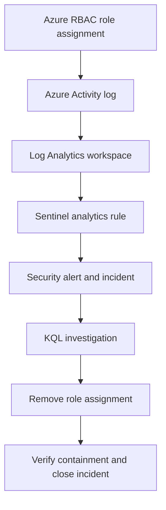

## Azure Services and Technologies

| Service or technology | Purpose |
|---|---|
| Azure Resource Manager | Hosted and managed the lab resources |
| Azure RBAC | Controlled access to the lab resource group |
| User-assigned managed identity | Served as the controlled test identity |
| Azure Activity log | Recorded role-assignment creation and deletion events |
| Log Analytics workspace | Stored and queried the activity data |
| Microsoft Sentinel | Provided SIEM detection and incident management |
| Sentinel analytics rule | Detected successful RBAC role assignments |
| Kusto Query Language | Supported detection, investigation, and containment verification |
| Azure Policy | Configured Azure Activity log streaming |
| Azure Cost Management | Monitored lab spending |

## Lab Configuration

| Component | Configuration |
|---|---|
| Resource group | `rg-sentinel-rbac-lab` |
| Log Analytics workspace | `law-sentinel-rbac-lab-2026` |
| Workspace region | West US |
| Log retention | 30 days |
| Data connector | Azure Activity |
| Test identity | `id-sentinel-rbac-lab` |
| Temporary role | Contributor |
| Assignment scope | Lab resource group only |
| Analytics rule | SOC - Azure RBAC Role Assignment Created |
| Rule severity | Medium |
| Query frequency | 5 minutes |
| Query lookback | 15 minutes |
| Incident classification | Benign Positive |
| Classification reason | Suspicious But Expected |

## Detection Logic

The custom Microsoft Sentinel analytics rule detected successful Azure RBAC role-assignment creation events:

```kusto
AzureActivity
| where OperationNameValue =~ "MICROSOFT.AUTHORIZATION/ROLEASSIGNMENTS/WRITE"
| where ActivityStatusValue =~ "Success"
| extend InitiatingAccount = tostring(Caller)
| project TimeGenerated,
          InitiatingAccount,
          OperationNameValue,
          ActivityStatusValue,
          ResourceGroup,
          ResourceId
```

The rule ran every five minutes and searched the previous fifteen minutes of Azure Activity data.

## Project Workflow

### 1. Cost monitoring

I created a monthly Azure budget with several alert thresholds before deploying the lab resources. This provided visibility into project spending and reduced the risk of unexpected charges.

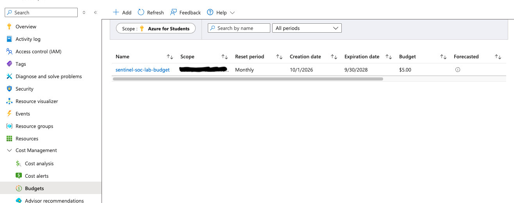

### 2. Lab resource group

I created `rg-sentinel-rbac-lab` to isolate the project resources and applied a project tag for identification and cost tracking.

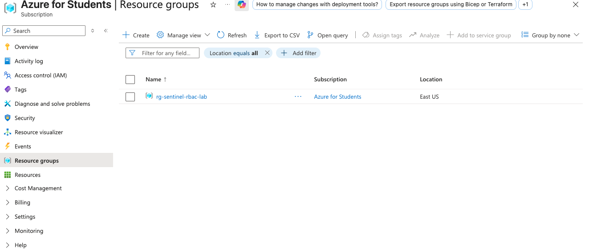

### 3. Log Analytics workspace

I deployed `law-sentinel-rbac-lab-2026` in an Azure Policy-approved region and configured a 30-day retention period.

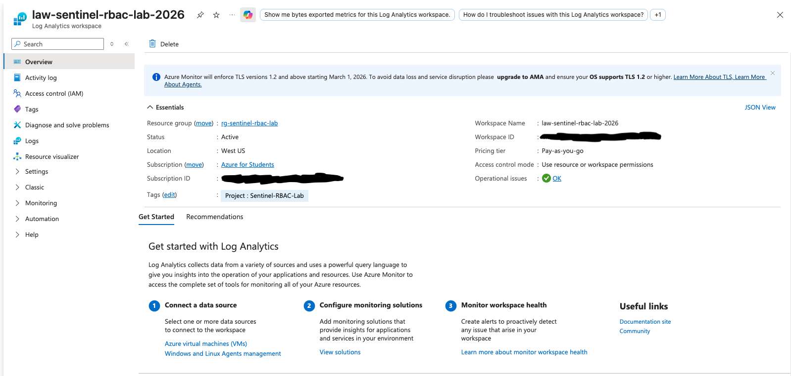

### 4. Microsoft Sentinel enablement

I enabled Microsoft Sentinel on the Log Analytics workspace. The workspace received a 31-day Microsoft Sentinel trial that included up to 10 GB of daily ingestion during the trial period.

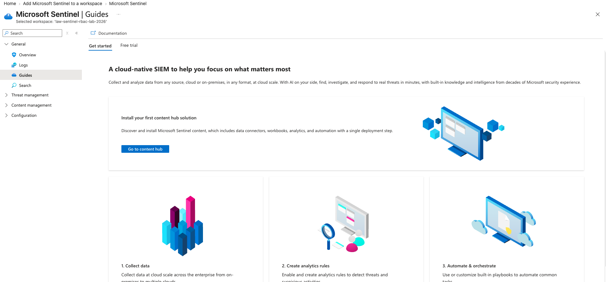

### 5. Azure Activity solution

I installed the Microsoft Sentinel Azure Activity solution. The solution provided the data connector, workbooks, analytics-rule templates, and hunting queries needed to monitor subscription-level Azure management activity.

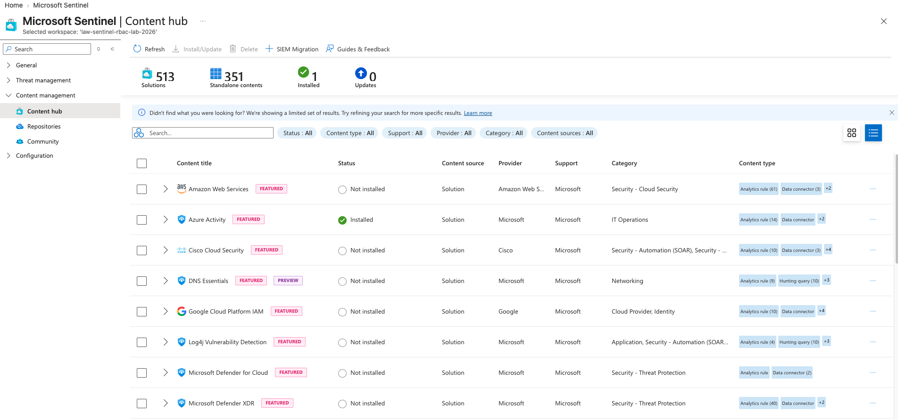

### 6. Azure Activity log ingestion

I used Azure Policy with a remediation task to configure subscription activity-log streaming to the Log Analytics workspace.

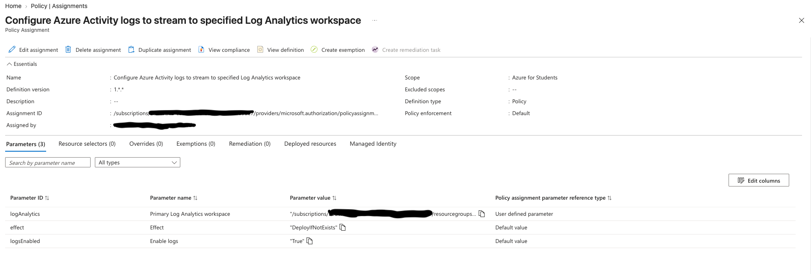

A KQL query confirmed that Azure management events were successfully reaching the workspace.

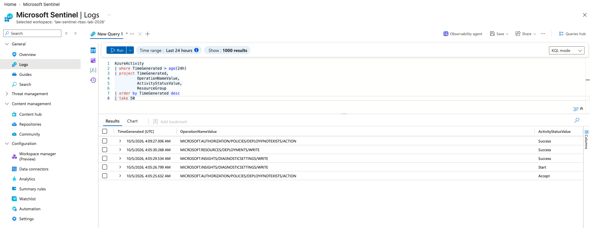

The Azure Activity data connector subsequently showed a connected status.

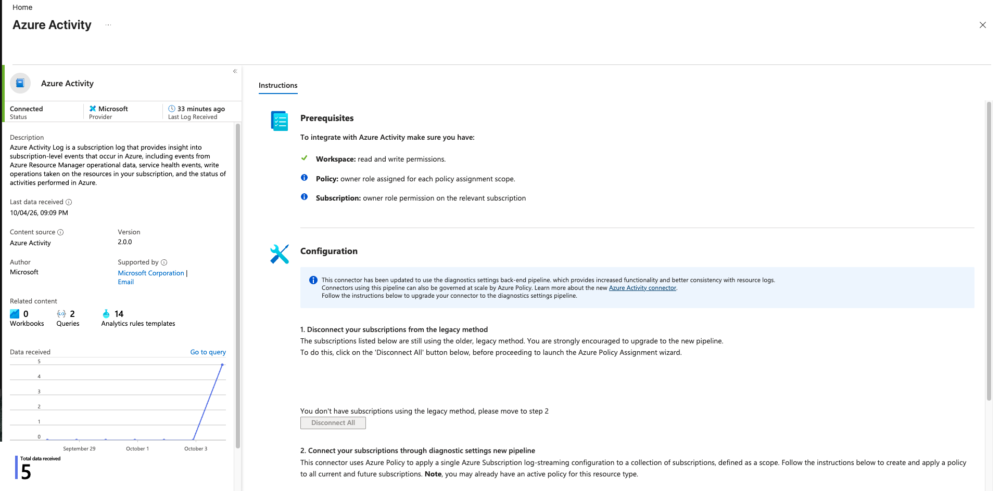

### 7. Controlled test identity

I created the user-assigned managed identity `id-sentinel-rbac-lab` as the controlled identity for the RBAC simulation.

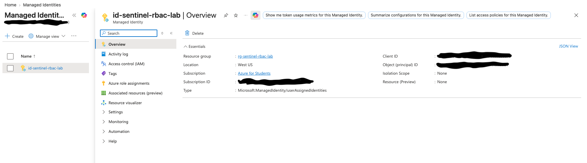

### 8. Custom analytics rule

I created and enabled the scheduled Microsoft Sentinel analytics rule:

`SOC - Azure RBAC Role Assignment Created`

The rule was configured with medium severity, a five-minute query frequency, and a fifteen-minute lookback period.

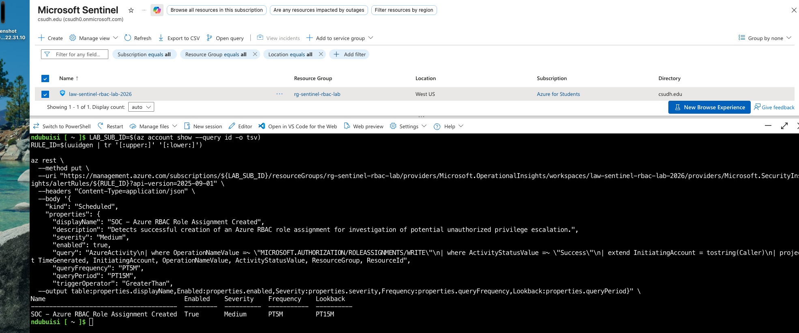

### 9. Controlled RBAC simulation

I temporarily assigned the Contributor role to `id-sentinel-rbac-lab` at only the `rg-sentinel-rbac-lab` resource-group scope.

Azure Activity recorded the operation as:

- Operation: `MICROSOFT.AUTHORIZATION/ROLEASSIGNMENTS/WRITE`
- Status: `Success`
- Resource group: `RG-SENTINEL-RBAC-LAB`

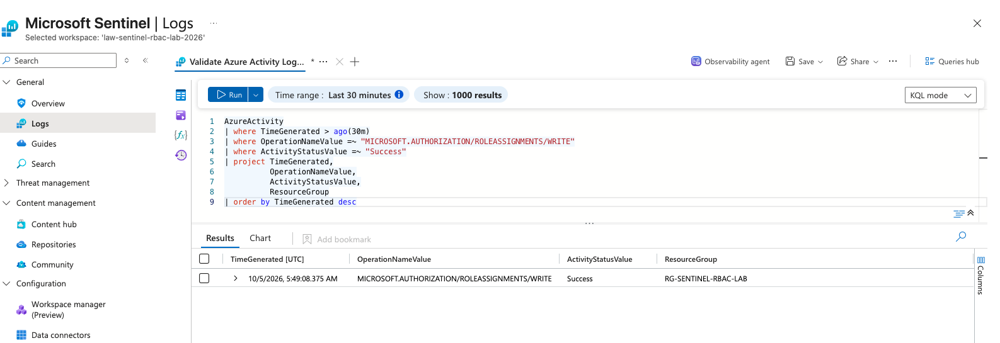

### 10. Detection and investigation

Microsoft Sentinel generated a medium-severity security alert and created Incident 1.

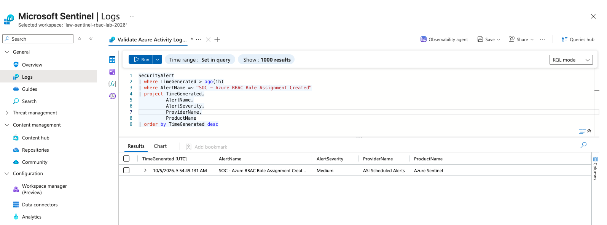

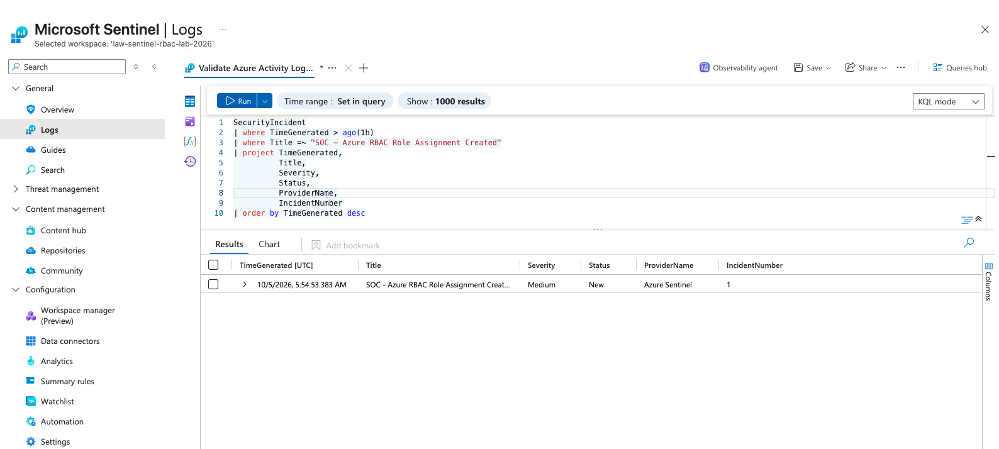

The investigation confirmed that:

- The role assignment completed successfully.
- The affected identity was the lab-managed identity.
- The assigned role was Contributor.
- The assignment was limited to the lab resource group.
- The activity matched the authorized simulation plan.
- No unauthorized access or malicious activity occurred.

The alert was generated approximately five minutes and forty-one seconds after the successful role assignment.

### 11. Containment

I removed the Contributor assignment from `id-sentinel-rbac-lab`.

After refreshing and filtering the resource-group role assignments, the managed identity no longer had Contributor access.

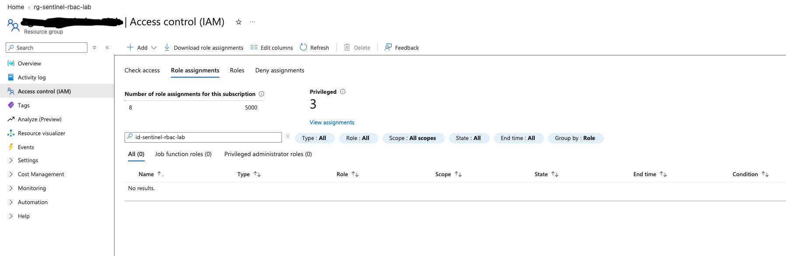

### 12. Containment verification

I queried Azure Activity for role-assignment deletion events:

```kusto
AzureActivity
| where OperationNameValue =~ "MICROSOFT.AUTHORIZATION/ROLEASSIGNMENTS/DELETE"
| project TimeGenerated,
          OperationNameValue,
          ActivityStatusValue,
          ResourceGroup,
          ResourceId,
          Caller
| sort by TimeGenerated desc
```

Azure Activity recorded both the start and successful completion of the deletion operation.

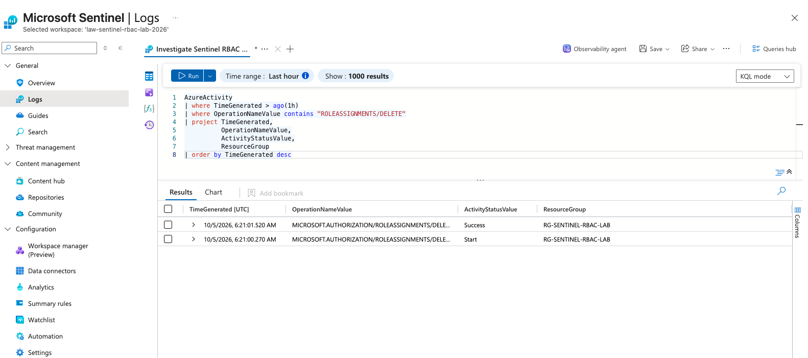

### 13. Incident closure

After verifying containment, I closed the Microsoft Sentinel incident with the following classification:

- **Status:** Closed
- **Severity:** Medium
- **Classification:** Benign Positive
- **Classification reason:** Suspicious But Expected

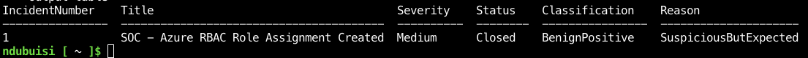

## Incident Timeline

| Time (UTC) | Event |
|---|---|
| 2026-10-05 05:49:08 | Contributor role assignment completed successfully |
| 2026-10-05 05:54:49 | Microsoft Sentinel generated a medium-severity alert |
| 2026-10-05 05:54:53 | Microsoft Sentinel created Incident 1 |
| 2026-10-05 06:21:00 | Role-assignment removal started |
| 2026-10-05 06:21:01 | Role-assignment removal completed successfully |
| After containment verification | Incident closed as Benign Positive |

The observed assignment-to-alert time was approximately five minutes and forty-one seconds.

## Investigation Queries

### Successful RBAC role assignments

```kusto
AzureActivity
| where OperationNameValue =~ "MICROSOFT.AUTHORIZATION/ROLEASSIGNMENTS/WRITE"
| where ActivityStatusValue =~ "Success"
| project TimeGenerated,
          OperationNameValue,
          ActivityStatusValue,
          ResourceGroup,
          ResourceId,
          Caller
| sort by TimeGenerated desc
```

### RBAC role-assignment removal

```kusto
AzureActivity
| where OperationNameValue =~ "MICROSOFT.AUTHORIZATION/ROLEASSIGNMENTS/DELETE"
| project TimeGenerated,
          OperationNameValue,
          ActivityStatusValue,
          ResourceGroup,
          ResourceId,
          Caller
| sort by TimeGenerated desc
```

## Security Findings

- Azure Activity successfully recorded the RBAC creation event.
- The custom KQL detection matched the expected activity.
- Microsoft Sentinel generated an alert and incident.
- The temporary assignment was limited to the lab resource group.
- No production or unrelated university resources were modified.
- No evidence of unauthorized access or malicious activity was identified.
- The Contributor role was successfully removed.
- Azure Activity recorded the containment operation.
- The incident was classified and closed with supporting evidence.

## Recommendations

- Follow least-privilege principles for Azure role assignments.
- Assign privileged roles at the narrowest practical scope.
- Monitor successful role-assignment creation and deletion.
- Investigate unexpected role assignments promptly.
- Use time-bound privileged access when available.
- Require appropriate approval for sensitive role assignments.
- Review inactive managed identities and service principals.
- Maintain Azure Activity ingestion in Microsoft Sentinel.
- Document investigation and containment actions.
- Remove temporary lab resources after preserving evidence.

## Challenges and Troubleshooting

### 1. Incorrect Azure subscription context

**Problem:**  
The first Log Analytics workspace deployment returned an authorization error because Azure Cloud Shell was operating under a different subscription context.

**Resolution:**  
I explicitly selected the Azure for Students subscription and verified that it was enabled and configured as the default before retrying the deployment.

```bash
az account set --subscription "Azure for Students"

az account show \
  --query "{Name:name, State:state, IsDefault:isDefault}" \
  --output table
```

**Lesson learned:**  
Always verify the active Azure subscription before creating or modifying resources, especially when an account can access multiple subscriptions.

### 2. Azure region restricted by subscription policy

**Problem:**  
Deployment to East US was blocked by an Azure Policy that limited resource creation to approved regions.

**Resolution:**  
I reviewed the assigned policy and identified its permitted locations. I then deployed the Log Analytics workspace to West US, which was included in the approved region list.

**Lesson learned:**  
Azure deployments may be restricted by organizational or subscription-level policies. The correct response is to review the policy and select an authorized region—not attempt to bypass the restriction.

### 3. Azure Activity connector initially showed “Not connected”

**Problem:**  
After installing the Azure Activity solution, the connector remained in a “Not connected” state because the subscription diagnostic settings had not yet been deployed.

**Resolution:**  
I assigned the built-in Azure Policy that streams Azure Activity logs to a Log Analytics workspace, enabled a system-assigned managed identity, and created a remediation task. After remediation completed, I validated log ingestion with KQL.

**Lesson learned:**  
Installing a Sentinel content solution does not automatically guarantee data ingestion. The diagnostic settings and policy remediation must also complete successfully.

### 4. Analytics-rule API rejected the MITRE sub-technique

**Problem:**  
The first API request to create the analytics rule returned a `BadRequest` error because the selected MITRE ATT&CK sub-technique value was not accepted by the API field.

**Resolution:**  
I corrected the analytics-rule configuration by using the supported parent-technique format and resubmitted the API request. The rule was then created and enabled successfully.

**Lesson learned:**  
API validation requirements may differ from expected ATT&CK notation. Error messages should be reviewed carefully, and unsupported metadata should be corrected without weakening the detection query.

### 5. Sentinel incident management moved to Microsoft Defender

**Problem:**  
The Azure portal redirected Sentinel incident management to the Microsoft Defender portal. The Defender interface produced a setup error, and completing its onboarding process risked changing configuration in a shared tenant.

**Resolution:**  
I avoided modifying the shared tenant configuration and used Azure Cloud Shell to manage the lab incident directly. I retrieved the incident identifier, closed the incident, applied the appropriate classification, and verified the final state through the Azure REST API.

**Lesson learned:**  
When a portal interface is unavailable or inappropriate for a shared environment, Azure CLI and REST APIs can provide controlled alternatives. Shared organizational settings should not be changed merely to complete a personal lab.

### 6. Incident update required existing properties

**Problem:**  
The first command used to close the Sentinel incident failed because the update request did not include a non-empty incident title.

**Resolution:**  
I included the existing incident title and severity in the update request and submitted it again. A separate read-only REST request confirmed the final incident state.

**Verified result:**

- Status: `Closed`
- Severity: `Medium`
- Classification: `BenignPositive`
- Classification reason: `SuspiciousButExpected`

**Lesson learned:**  
Before updating a cloud resource through an API, preserve required existing properties and verify the result with a separate read-only request.

## Skills Demonstrated

- Microsoft Sentinel administration
- Azure Activity log analysis
- Azure RBAC and identity security
- Kusto Query Language
- SIEM monitoring
- Detection engineering
- Custom analytics rules
- Alert and incident investigation
- Cloud incident response
- Privilege containment
- Azure Policy and remediation
- Azure CLI and REST API troubleshooting
- Security documentation
- Cloud cost management

## Project Evidence

Redacted screenshots documenting the project are available in the [`screenshots`](screenshots) directory.

The complete investigation record is available in [`incident-report.md`](incident-report.md).

## Cleanup and Cost Control

After completing the investigation and preserving the project evidence, I removed the temporary Azure resources to prevent unnecessary charges and eliminate unused access.

The cleanup included:

- Removing the Contributor role assignment from the test managed identity
- Deleting the user-assigned managed identity
- Deleting the custom Microsoft Sentinel analytics rule
- Removing the policy-managed identity's subscription-level permissions
- Deleting the Azure Activity policy assignment
- Deleting the subscription diagnostic setting
- Deleting the Log Analytics workspace
- Removing the Microsoft Sentinel solution
- Deleting the lab resource group
- Reviewing Azure Cost Management for remaining usage

A final Azure CLI check returned `false` for the existence of `rg-sentinel-rbac-lab`, confirming that the resource group and its remaining resources were deleted.

Azure Cost Management reported no cost for the project period after cleanup. The subscription-level budget was retained because it does not create usage charges and continues to provide protection against unexpected future spending.

This cleanup demonstrated responsible cloud-resource lifecycle management, access revocation, and cost awareness.

## Lessons Learned

This project demonstrated that cloud IAM monitoring involves more than detecting a role assignment. An analyst must determine who initiated the change, identify the affected identity and assigned privilege, evaluate the assignment scope, determine whether the activity was authorized, contain unnecessary access, verify the containment action, and document the final classification.

The project also demonstrated the importance of troubleshooting Azure subscription context, deployment policies, data-connector configuration, API validation, and portal limitations.

When the Microsoft Defender interface could not safely support the lab workflow, Azure CLI and REST API commands provided an alternative method for closing and verifying the incident without changing shared tenant settings.

Overall, Azure Activity, Log Analytics, KQL, Microsoft Sentinel, Azure Policy, and Azure RBAC were successfully integrated into an end-to-end cloud security monitoring workflow.

## Disclaimer

This project was completed in an authorized personal lab environment. The role assignment was intentionally generated for educational purposes. No unauthorized access, exploitation, or malicious activity was performed.
